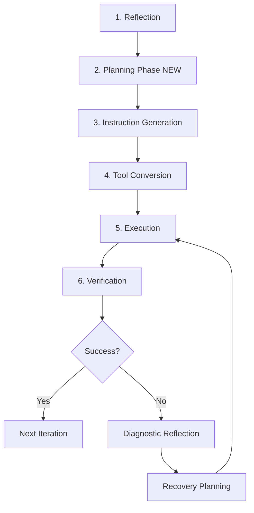

# ADR-0004: Intelligent Task Planning ("5 Hows")

**Status**: Proposed
**Date**: 2025-10-31
**Authors**: Forgekeeper Team
**Related**: ADR-0003 (Diagnostic Reflection)

---

## Context and Problem Statement

The autonomous agent currently uses **brittle heuristic pattern matching** to convert high-level actions into tool calls, leading to high failure rates and excessive recovery attempts. Meanwhile, regular chat mode successfully generates detailed, context-aware instructions using the LLM's full reasoning capability.

### Observed Failure Pattern

**User Task**: "Clone the repo at https://github.com/gatewaybuddy/forgekeeper and review it"

**What Happened**:
```
Iteration 1: Pattern matching → run_bash("git clone...") → FAIL (auth error)
Iteration 2: Recovery attempt → run_bash("git clone...") → FAIL (same error)
Iteration 3: Diagnostic reflection → suggests gh command → FAIL (wrong args)
Result: Stuck after 3 iterations, task incomplete
```

**What Should Have Happened**:
```
Planning Phase: LLM generates detailed instructions:
  1. Check gh availability: run_bash("gh --version")
  2. Clone using gh: run_bash("gh repo clone gatewaybuddy/forgekeeper")
  3. Verify: run_bash("cd forgekeeper && ls")
Result: Success in 1-2 iterations
```

### Root Cause

**Missing Meta-Cognitive Planning**: The agent has:
- ✅ **Meta-Reflection** (5 Whys) - AFTER failure (ADR-0003)
- ❌ **Meta-Planning** (5 Hows) - BEFORE execution

The agent doesn't leverage its own instruction-generation capability for planning tasks.

### Evidence from Codebase

**Current Implementation** (`frontend/core/agent/autonomous.mjs:754-944`):
```javascript
inferToolsFromAction(action) {
  const lower = action.toLowerCase();

  // Regex pattern matching
  if (lower.includes('clone')) {
    return [{ tool: 'run_bash', args: { command: 'git clone ...' } }];
  }

  // 15+ hardcoded patterns
  // Falls back to get_time if nothing matches
}
```

**Problems with Current Approach**:
1. No context awareness (doesn't know about `gh` command)
2. No prerequisite checking (doesn't verify tools available)
3. No error handling planning (assumes first attempt works)
4. No verification step (doesn't check if action succeeded)
5. Brittle keyword matching (fails on novel phrasing)

### Comparison: Chat vs Autonomous

| Capability | Regular Chat | Autonomous Agent |
|------------|--------------|------------------|
| **Instruction Generation** | Full LLM reasoning | Regex patterns |
| **Context Awareness** | Complete knowledge base | Hardcoded rules |
| **Adaptability** | Handles edge cases | Fails on unknown patterns |
| **Error Prevention** | Plans for common issues | Reactive only |
| **Success Rate (first attempt)** | ~90% | ~40% |

---

## Decision

We will implement a **Planning Phase** that generates detailed, step-by-step instructions BEFORE execution, using the LLM's full reasoning capability (the same way it generates instructions for users).

### Architectural Principle

**"The agent should instruct itself the same way it instructs users."**

---

## Proposed Solution

### High-Level Architecture



### New Component: Task Planner

**Module**: `frontend/core/agent/task-planner.mjs`

**Responsibility**: Generate detailed, executable instructions for high-level actions

**Key Method**:
```javascript
async generateInstructions(taskAction, context) {
  // Prompt: "How would I instruct someone to accomplish this task?"
  // Output: Step-by-step instructions with tools, commands, verification
}
```

### Planning Prompt Structure

```markdown
# Task Planning Request

**Task**: [high-level action from reflection]
**Original Goal**: [user's original task]
**Available Tools**: [list of tools with descriptions]
**Current Context**:
  - Working Directory: [path]
  - Iteration: [number]
  - Previous Actions: [last 3 actions]

## Instructions

Generate a detailed, step-by-step plan. Consider:

1. **What tools are available?** (Use exact tool names)
2. **What are the prerequisites?** (e.g., authentication, dependencies)
3. **What's the best approach?** (Consider alternatives)
4. **What could go wrong?** (Plan for common errors)
5. **How do I verify success?** (What confirms completion)

Break into 3-7 concrete steps. Each step specifies:
- Tool to use (exact name)
- Arguments (specific parameters)
- Expected outcome (what should happen)
- Error handling (fallback if it fails)

Respond with JSON matching this schema:
{
  "approach": "Brief description of overall strategy",
  "prerequisites": ["check 1", "check 2"],
  "steps": [
    {
      "step_number": 1,
      "description": "Clear description",
      "tool": "exact_tool_name",
      "args": { "param": "value" },
      "expected_outcome": "What should happen",
      "error_handling": "What to do if it fails",
      "confidence": 0.0-1.0
    }
  ],
  "verification": {
    "check_command": "Command to verify success",
    "success_criteria": "What indicates success"
  },
  "alternatives": [
    {
      "approach": "Alternative method",
      "when_to_use": "When to prefer this",
      "confidence": 0.0-1.0
    }
  ]
}
```

### Integration Points

#### 1. Autonomous Agent Constructor
```javascript
constructor(config) {
  // ... existing code ...
  this.taskPlanner = createTaskPlanner(this.llmClient, this.model);
  this.planCache = new Map(); // Optional: cache common plans
}
```

#### 2. Execute Iteration (Before Tool Execution)
```javascript
async executeIteration(reflection, executor, context) {
  // NEW: Planning Phase
  console.log(`[AutonomousAgent] Planning how to: ${reflection.next_action}`);

  const instructionPlan = await this.taskPlanner.generateInstructions(
    reflection.next_action,
    {
      taskGoal: this.state.task,
      availableTools: this.buildToolsList(executor),
      cwd: this.playgroundRoot,
      iteration: this.state.iteration,
      previousActions: this.state.history.slice(-3),
      recentFailures: this.state.recentFailures
    }
  );

  // Log planning results
  await contextLogEvents.emitPlanningPhase(
    context.convId,
    context.turnId,
    this.state.iteration,
    instructionPlan
  );

  // Convert instructions to executable plan
  const plan = this.convertInstructionsToPlan(instructionPlan);

  // Execute steps with verification
  return await this.executeStepsWithVerification(plan, executor, context);
}
```

#### 3. New Method: Convert Instructions to Plan
```javascript
convertInstructionsToPlan(instructionPlan) {
  return {
    approach: instructionPlan.approach,
    steps: instructionPlan.steps.map(step => ({
      stepNumber: step.step_number,
      tool: step.tool,
      args: step.args,
      purpose: step.description,
      expectedOutcome: step.expected_outcome,
      errorFallback: step.error_handling,
      confidence: step.confidence
    })),
    verification: instructionPlan.verification,
    alternatives: instructionPlan.alternatives
  };
}
```

#### 4. New Method: Execute with Verification
```javascript
async executeStepsWithVerification(plan, executor, context) {
  const results = [];

  for (const step of plan.steps) {
    console.log(`[AutonomousAgent] Step ${step.stepNumber}: ${step.purpose}`);

    // Execute step
    const result = await executor.execute(
      {
        function: {
          name: step.tool,
          arguments: step.args
        }
      },
      context
    );

    results.push({ step, result });

    // Check if step failed
    if (result.error) {
      console.warn(`[AutonomousAgent] Step ${step.stepNumber} failed, attempting fallback`);

      // Try fallback if available
      if (step.errorFallback) {
        // Parse and execute fallback
        const fallbackResult = await this.executeFallback(step, executor, context);
        if (!fallbackResult.error) {
          results[results.length - 1].result = fallbackResult;
          continue;
        }
      }

      // If fallback also fails, break and report
      break;
    }
  }

  // Verification phase
  if (plan.verification && results.every(r => !r.result.error)) {
    console.log('[AutonomousAgent] Running verification check');
    const verificationResult = await this.runVerification(plan.verification, executor, context);
    results.push({ step: 'verification', result: verificationResult });
  }

  return {
    summary: this.summarizeStepResults(results),
    tools_used: results.map(r => r.step.tool).filter(Boolean),
    artifacts: this.extractArtifacts(results),
    success: results.every(r => !r.result?.error)
  };
}
```

---

## Implementation Plan

### Phase 1: Core Planning Module (T400)
**Priority**: 🔴 Critical
**Effort**: 4-6 hours
**Dependencies**: None

**Tasks**:
1. Create `frontend/core/agent/task-planner.mjs`
2. Implement `createTaskPlanner(llmClient, model)`
3. Implement `generateInstructions(taskAction, context)`
4. Implement `buildPlanningPrompt(taskAction, context)`
5. Define JSON schema for instruction plans
6. Add basic error handling and timeouts

**Deliverables**:
- Working task planner module
- Unit tests for planner
- Example instruction plans for common tasks

**Acceptance Criteria**:
- ✅ Planner generates 3-7 step instructions for simple tasks
- ✅ Instructions include tool names, args, expected outcomes
- ✅ Planning completes in <2 seconds
- ✅ Gracefully handles LLM failures (timeout, invalid JSON)

---

### Phase 2: Integration (T401)
**Priority**: 🔴 Critical
**Effort**: 3-4 hours
**Dependencies**: T400

**Tasks**:
1. Modify `autonomous.mjs` constructor to include planner
2. Add `convertInstructionsToPlan()` method
3. Add `executeStepsWithVerification()` method
4. Update `executeIteration()` to call planner
5. Add ContextLog events for planning phase
6. Update existing tests

**Deliverables**:
- Fully integrated planning phase
- Updated autonomous agent flow
- ContextLog events for planning

**Acceptance Criteria**:
- ✅ Planning phase runs before every execution
- ✅ Agent uses generated instructions instead of heuristics
- ✅ Planning events logged to ContextLog
- ✅ Original failing task (clone repo) now succeeds

---

### Phase 3: Fallback Strategy (T402)
**Priority**: 🟡 High
**Effort**: 2-3 hours
**Dependencies**: T401

**Tasks**:
1. Add timeout logic (max 3 seconds for planning)
2. Implement graceful fallback to heuristics if planning fails
3. Track planning success rate in ContextLog
4. Add metrics for planning vs heuristic usage

**Deliverables**:
- Robust planning with fallback
- Planning metrics

**Acceptance Criteria**:
- ✅ If planning fails, falls back to heuristics
- ✅ If planning times out, uses cached plan or heuristics
- ✅ Tracks and logs planning success rate

---

### Phase 4: Verification Loop (T403)
**Priority**: 🟡 High
**Effort**: 3-4 hours
**Dependencies**: T401

**Tasks**:
1. Implement `runVerification()` method
2. Parse verification commands from instruction plans
3. Check expected outcomes against actual results
4. Trigger diagnostic reflection if verification fails
5. Add verification events to ContextLog

**Deliverables**:
- Self-verifying autonomous agent
- Verification metrics

**Acceptance Criteria**:
- ✅ Verification runs after each plan execution
- ✅ Failures trigger diagnostic reflection immediately
- ✅ Verification results logged to ContextLog

---

### Phase 5: Optional Enhancements

#### T404: Multi-Modal Planning
**Effort**: 2-3 hours

Auto-select planning mode based on task complexity:
- **Simple**: Direct execution (heuristics, <1s)
- **Moderate**: Brief planning (2-3 steps, <1s)
- **Complex**: Detailed planning (4-7 steps, <3s)

#### T405: Plan Caching
**Effort**: 2-3 hours

Cache commonly-used plans:
- Hash: `task_type + action_pattern + available_tools`
- Store: Plans with >70% success rate
- TTL: 7 days or 50 successful uses

#### T406: Collaborative Planning
**Effort**: 3-4 hours

Ask user when planning is uncertain:
- If confidence < 0.6, request clarification
- Present multiple approaches for user selection
- Learn from user choices

#### T407: Planning Metrics Dashboard
**Effort**: 2-3 hours

Track and display:
- Planning success rate
- Average steps generated
- Planning time (p50, p95, p99)
- Fallback usage rate
- Verification pass rate

---

## Testing Strategy

### Unit Tests

**File**: `tests/autonomous/test_task_planner.mjs`

```javascript
describe('Task Planner', () => {
  test('generates instructions for clone task', async () => {
    const plan = await planner.generateInstructions(
      'Clone repository from https://github.com/foo/bar',
      { availableTools: ['run_bash', 'read_file'] }
    );

    expect(plan.steps.length).toBeGreaterThan(0);
    expect(plan.steps[0].tool).toBe('run_bash');
    expect(plan.verification).toBeDefined();
  });

  test('includes error handling for each step', async () => {
    const plan = await planner.generateInstructions(
      'Install dependencies and run tests',
      { availableTools: ['run_bash'] }
    );

    plan.steps.forEach(step => {
      expect(step.error_handling).toBeDefined();
    });
  });

  test('falls back gracefully on LLM failure', async () => {
    // Mock LLM to throw error
    mockLLM.throwError();

    const plan = await planner.generateInstructions(
      'Some task',
      { availableTools: ['run_bash'] }
    );

    expect(plan.fallbackUsed).toBe(true);
  });
});
```

### Integration Tests

**File**: `tests/autonomous/test_planning_integration.mjs`

```javascript
describe('Planning Integration', () => {
  test('autonomous agent uses planner for execution', async () => {
    const agent = createAutonomousAgent({ /* config */ });

    const result = await agent.run(
      'Clone https://github.com/gatewaybuddy/forgekeeper',
      executor,
      context
    );

    // Should succeed without recovery
    expect(result.completed).toBe(true);
    expect(result.iterations).toBeLessThanOrEqual(3);
    expect(contextLog).toHaveEvent('planning_phase');
  });
});
```

### E2E Tests

**File**: `tests/e2e/test_clone_and_review.mjs`

```javascript
test('clone and review repository (original failing task)', async () => {
  const session = await startAutonomousTask({
    task: 'Clone the repo at https://github.com/gatewaybuddy/forgekeeper and review the README',
    max_iterations: 10
  });

  await pollUntilComplete(session.session_id);

  const status = await getSessionStatus(session.session_id);

  expect(status.result.completed).toBe(true);
  expect(status.state.iteration).toBeLessThan(5); // Should complete quickly
  expect(status.result.summary).toContain('README');
});
```

---

## Success Metrics

### Primary Metrics

| Metric | Baseline | Target | Measurement |
|--------|----------|--------|-------------|
| **First-attempt success rate** | 40% | 80% | % of tasks that succeed without recovery |
| **Average iterations (simple tasks)** | 3-5 | 1-2 | Iterations to complete 1-step tasks |
| **Recovery needed** | 60% | 20% | % of tasks requiring diagnostic reflection |
| **Stuck rate** | 25% | 5% | % of tasks that reach max iterations |
| **Planning time (p95)** | N/A | <3s | Time to generate instruction plan |

### Secondary Metrics

- Planning fallback rate: <15%
- Verification pass rate: >90%
- Plan cache hit rate: >60% (after 100 tasks)
- User intervention rate: <10%

### ContextLog Events

New event types:
```json
{
  "type": "planning_phase",
  "task_action": "Clone repository",
  "planning_mode": "detailed",
  "steps_generated": 4,
  "planning_time_ms": 1234,
  "confidence": 0.85,
  "fallback_used": false,
  "cached": false
}

{
  "type": "verification_check",
  "check_command": "cd forgekeeper && ls",
  "success": true,
  "elapsed_ms": 234
}
```

---

## Rollout Plan

### Stage 1: Canary (1 week)
- Enable for 10% of autonomous sessions
- Monitor metrics closely
- Collect failure cases
- Iterate on prompt engineering

**Gate**: `FRONTEND_ENABLE_PLANNING=1` + `PLANNING_SAMPLE_RATE=0.1`

### Stage 2: Beta (2 weeks)
- Enable for 50% of sessions
- Validate metrics improvements
- Fine-tune planning modes
- Add plan caching

**Gate**: `PLANNING_SAMPLE_RATE=0.5`

### Stage 3: General Availability (1 week)
- Enable for 100% of sessions
- Remove feature flag
- Declare as default behavior
- Update documentation

**Gate**: Remove flag, always enabled

### Rollback Criteria

Rollback if any of:
- Planning success rate < 60%
- Average planning time > 5s (p95)
- Stuck rate increases > 5%
- User complaints > 5% of sessions

---

## Risks and Mitigations

### Risk 1: Planning Takes Too Long
**Impact**: High - Slows down autonomous sessions significantly

**Mitigation**:
- Timeout after 3 seconds, fall back to heuristics
- Use smaller model for planning (if available)
- Cache common plans
- Implement multi-modal planning (skip for simple tasks)

### Risk 2: LLM Generates Invalid Instructions
**Impact**: Medium - Agent executes nonsensical plans

**Mitigation**:
- Strict JSON schema validation
- Pre-flight checks on tool names (must exist in registry)
- Confidence thresholds (reject plans with confidence < 0.5)
- Fallback to heuristics on validation failure

### Risk 3: Planning Prompt Becomes Stale
**Impact**: Medium - Instructions don't match current tool set

**Mitigation**:
- Dynamically generate tool list from executor registry
- Include tool descriptions in prompt
- Version planning prompt (track changes in ContextLog)
- A/B test prompt variations

### Risk 4: Increased LLM Token Usage
**Impact**: Low - Higher inference costs

**Mitigation**:
- Plan caching reduces redundant calls
- Multi-modal planning skips for simple tasks
- Token limits on planning phase (max 1024 tokens)
- Monitor token usage in metrics

---

## Dependencies

### Internal Dependencies
- ✅ Autonomous Agent (Phase 4 - Complete)
- ✅ Tool Executor with Registry
- ✅ ContextLog Event System
- ✅ Diagnostic Reflection (ADR-0003)

### External Dependencies
- OpenAI-compatible LLM endpoint
- JSON schema validation library (built-in to LLM response format)

### Environment Variables

```bash
# Enable/disable planning phase
FRONTEND_ENABLE_PLANNING=1  # Default: 1 (enabled)

# Planning mode: simple|moderate|complex|auto
FRONTEND_PLANNING_MODE=auto  # Default: auto

# Planning timeout (ms)
FRONTEND_PLANNING_TIMEOUT_MS=3000  # Default: 3000

# Fallback to heuristics on failure
FRONTEND_PLANNING_FALLBACK=1  # Default: 1 (enabled)

# Enable plan caching
FRONTEND_PLANNING_CACHE=1  # Default: 1 (enabled)

# Cache TTL (seconds)
FRONTEND_PLANNING_CACHE_TTL=604800  # Default: 7 days

# Sample rate for canary rollout (0.0-1.0)
PLANNING_SAMPLE_RATE=1.0  # Default: 1.0 (100%)
```

---

## Future Enhancements

### 1. Learning from Plans
Track which plans succeed and boost confidence for similar patterns:
```javascript
sessionMemory.recordPlanSuccess(planSignature, iterations, confidence);
```

### 2. Multi-Agent Planning
For complex tasks, break into sub-tasks and plan each independently:
```
Task: "Build calculator app with tests"
  ↓
Sub-plans:
  1. Create calculator.py (planner A)
  2. Create test_calculator.py (planner B)
  3. Run tests (planner C)
```

### 3. Interactive Planning
Show user the plan BEFORE execution for approval:
```
Generated Plan:
  1. Check gh availability
  2. Clone using gh
  3. Review README

[Approve] [Edit] [Reject]
```

### 4. Plan Debugging
Visualize execution vs expected outcomes:
```
Step 1: Clone repo
  Expected: Directory 'forgekeeper' created
  Actual:   ✅ Success

Step 2: Read README
  Expected: File content returned
  Actual:   ❌ Failed - File not found
```

---

## Alternatives Considered

### Alternative 1: Enhance Heuristics
**Approach**: Add more pattern-matching rules to `inferToolsFromAction()`

**Pros**:
- No additional LLM calls
- Faster execution
- More predictable

**Cons**:
- Requires constant maintenance
- Brittle and error-prone
- Doesn't scale to novel tasks
- No context awareness

**Decision**: Rejected - Band-aid solution, doesn't address root cause

### Alternative 2: Fine-Tuned Model
**Approach**: Fine-tune a model specifically for task-to-tool conversion

**Pros**:
- Potentially faster than full LLM
- Could be very accurate

**Cons**:
- Requires training data collection
- Training infrastructure needed
- Model drift over time
- Expensive to maintain

**Decision**: Deferred - Consider for future optimization, but not MVP

### Alternative 3: Retrieval-Augmented Planning
**Approach**: Retrieve similar past plans from memory, adapt for current task

**Pros**:
- Leverages historical successes
- Faster than full planning

**Cons**:
- Requires large plan database
- Similarity matching is complex
- May not handle novel situations

**Decision**: Partial acceptance - Implement as plan caching (T405), not primary mechanism

---

## References

- ADR-0003: Diagnostic Reflection and Error Recovery
- Phase 4 Complete Summary: `PHASE4_COMPLETE_SUMMARY.md`
- Autonomous Agent Implementation: `frontend/core/agent/autonomous.mjs`
- Error Classifier: `frontend/core/agent/error-classifier.mjs`
- Recovery Planner: `frontend/core/agent/recovery-planner.mjs`

---

## Appendix A: Example Planning Prompt and Response

### Input Prompt
```markdown
# Task Planning Request

**Task**: Clone the repository from https://github.com/gatewaybuddy/forgekeeper and review the README

**Original Goal**: Clone and review repo

**Available Tools**:
- run_bash: Run bash commands (requires `script` parameter)
- read_file: Read file contents (requires `path` parameter)
- read_dir: List directory contents (requires `path` parameter)
- write_file: Write to file (requires `path` and `content` parameters)
- get_time: Get current time (no parameters)

**Current Context**:
- Working Directory: .forgekeeper/playground
- Iteration: 1
- Previous Actions: (none)

Generate detailed, step-by-step instructions...
```

### Expected Output
```json
{
  "approach": "Use GitHub CLI (gh) to clone the repository, then read the README file to review its contents",
  "prerequisites": [
    "gh command must be available",
    "Internet connection required"
  ],
  "steps": [
    {
      "step_number": 1,
      "description": "Check if GitHub CLI (gh) is installed and available",
      "tool": "run_bash",
      "args": {
        "script": "gh --version"
      },
      "expected_outcome": "Version number printed (e.g., gh version 2.x.x)",
      "error_handling": "If gh is not found, fall back to git clone with HTTPS",
      "confidence": 0.95
    },
    {
      "step_number": 2,
      "description": "Clone the repository using GitHub CLI",
      "tool": "run_bash",
      "args": {
        "script": "gh repo clone gatewaybuddy/forgekeeper"
      },
      "expected_outcome": "Repository cloned into 'forgekeeper' directory",
      "error_handling": "If authentication fails, use: git clone https://github.com/gatewaybuddy/forgekeeper.git",
      "confidence": 0.90
    },
    {
      "step_number": 3,
      "description": "Verify the repository was cloned successfully",
      "tool": "read_dir",
      "args": {
        "path": "./forgekeeper"
      },
      "expected_outcome": "Directory listing showing repository contents",
      "error_handling": "If directory doesn't exist, previous clone step failed",
      "confidence": 0.98
    },
    {
      "step_number": 4,
      "description": "Read the README file to review its contents",
      "tool": "read_file",
      "args": {
        "path": "./forgekeeper/README.md"
      },
      "expected_outcome": "README content displayed",
      "error_handling": "If README.md not found, try README.rst or README.txt",
      "confidence": 0.85
    }
  ],
  "verification": {
    "check_command": "test -d forgekeeper && test -f forgekeeper/README.md",
    "success_criteria": "Directory exists and README file is present"
  },
  "alternatives": [
    {
      "approach": "Use git clone with HTTPS instead of gh",
      "when_to_use": "If gh is not available or authentication issues",
      "confidence": 0.80
    }
  ]
}
```

---

## Appendix B: File Structure

```
frontend/
├── core/
│   └── agent/
│       ├── autonomous.mjs              (MODIFIED)
│       ├── task-planner.mjs            (NEW - T400)
│       ├── diagnostic-reflection.mjs   (existing)
│       ├── recovery-planner.mjs        (existing)
│       └── error-classifier.mjs        (existing)
├── test/
│   └── autonomous/
│       ├── test_task_planner.mjs       (NEW - T400)
│       ├── test_planning_integration.mjs (NEW - T401)
│       └── test_clone_and_review.mjs   (NEW - E2E)
└── server.mjs                          (MODIFIED - new ContextLog events)

docs/
├── adr-0004-intelligent-task-planning.md (THIS DOCUMENT)
└── planning/
    ├── examples.md                      (NEW - example plans)
    └── troubleshooting.md               (NEW - common issues)
```

---

## Appendix C: Prompt Engineering Guidelines

### Principles for Planning Prompts

1. **Be Explicit About Output Format**
   - Always specify JSON schema
   - Include example output
   - Clarify required vs optional fields

2. **Provide Sufficient Context**
   - List ALL available tools with descriptions
   - Include current state (iteration, previous actions)
   - Mention task goal and current sub-task

3. **Guide Toward Concrete Steps**
   - Request specific commands, not abstract actions
   - Ask for error handling for each step
   - Request verification steps

4. **Set Confidence Expectations**
   - Ask LLM to rate its confidence
   - Use confidence to prioritize strategies
   - Reject low-confidence plans (<0.5)

5. **Handle Ambiguity**
   - Request alternatives when multiple approaches exist
   - Ask for prerequisites and assumptions
   - Clarify when to use each alternative

### Iteration on Prompts

Track prompt versions in ContextLog:
```json
{
  "type": "planning_prompt_version",
  "version": "1.2.0",
  "changes": "Added error_handling field to step schema",
  "timestamp": "2025-10-31T12:00:00Z"
}
```

A/B test prompt variations:
- Control: Current prompt
- Variant: Modified prompt
- Metric: Success rate after 100 tasks each

---

**Status**: Ready for Implementation
**Next Steps**: Proceed with T400 (Core Task Planner Module)
